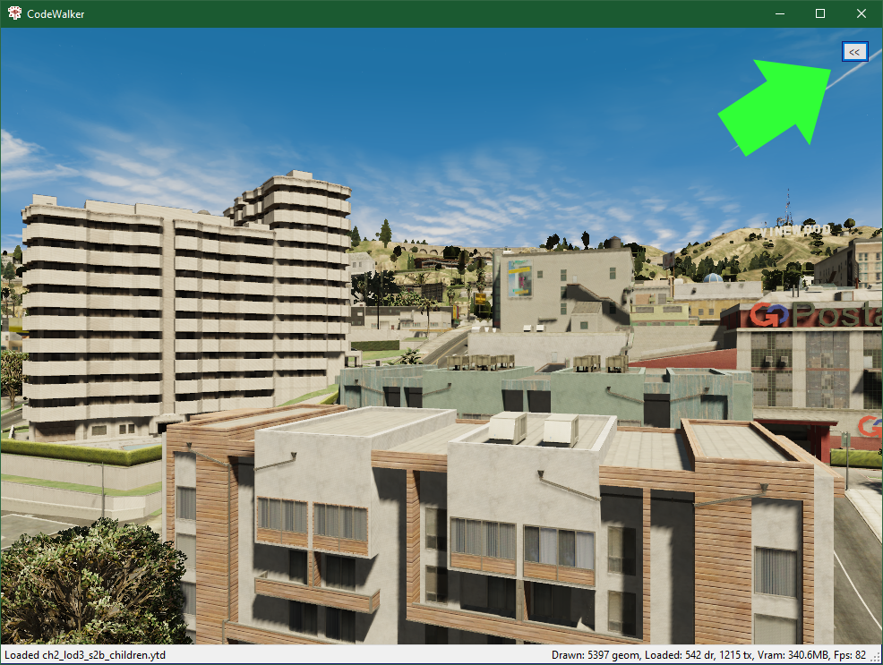
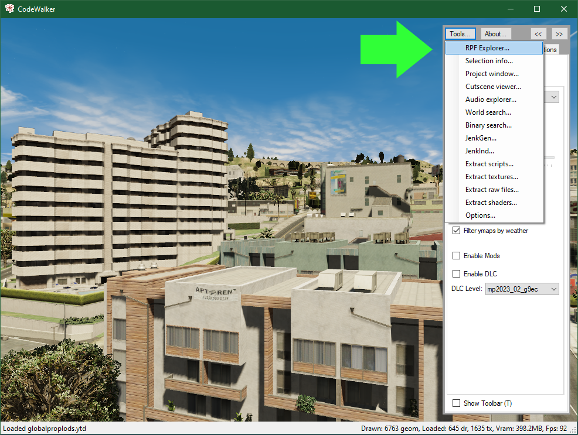
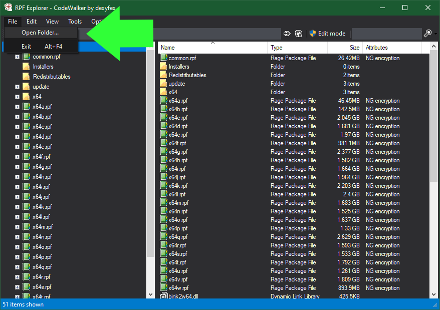
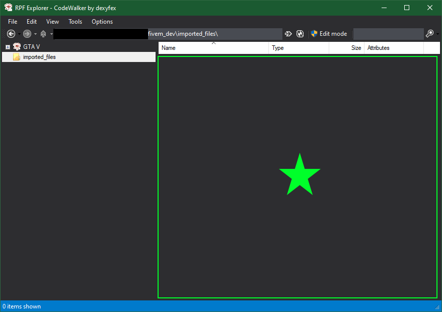

# CodeWalker Usage Guide

This is meant as a guide for the post-generation import steps that will take the user out of GTA and into CodeWalker.

[CodeWalker](https://github.com/dexyfex/CodeWalker) is an app that renders the GTAV map and allows users to work with game content files. The most up-to-date release can be downloaded from the [CodeWalker Discord Guild](https://discord.com/invite/BxfKHkk).

## Usage Steps

1. Open CodeWalker and expand the side menu by pressing the `<<` button in the top right
   
   
2. Open the RPF Explorer
   - `Tools... -> RPF Explorer...`

   
3. Once the RPF Explorer is loaded up, open the folder that you want the parsed output files to save to
   - `File -> Open Folder...`
   - *Note:* This doesn't have to be the final destination of the files

   
4. With the chosen folder open in the RPF Explorer turn on `Edit Mode` but pressing the `Edit Mode` button near the top of the RPF Explorer Window

   
5. With `Edit Mode` enabled, manually drag the .xml files that were generated by the MLO Tool from Windows Explorer to the RPF Explorer Window

    
6. You can now use these files as described in steps 10 and 11 of the [Usage Guide](./usage-guide.md#usage-steps)
