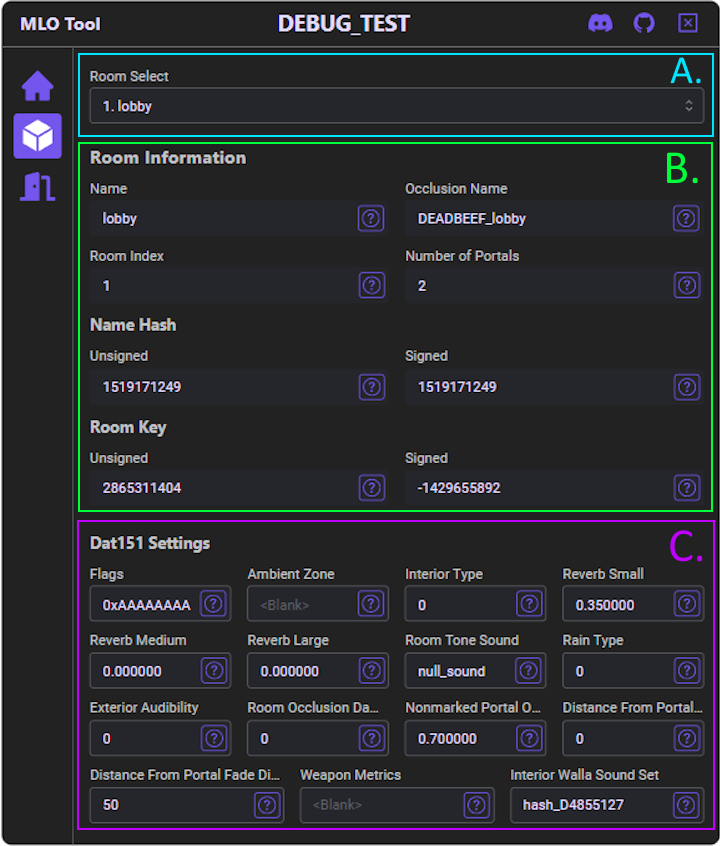

# Usage Guide

## Background

This resource is meant to make the generation of `.ymt` and `.dat151.rel` files less labor intensive than trying to build them out by hand.

If you are unfamiliar with `.ymt` and `.dat151.rel` files they are the two main files types that are used for Interior Audio Occlusion within GTAV. You can read more [here](./definitions.md).

## Setting Expectations

This resource **WILL NOT** live update audio occlusion. As far as I'm aware that isn't possible at this time and I will not be performing miracles for free at this time.

This resource **CAN** *help* you generate the necessary files to calcualte audio occlusion within Interiors.

## Commands

### openmlo

> `/openmlo [1|2]`

Used to open the UI that allows you to interact with the MLO that your ped is currently standing in.

- *Optional* Argument
   - `1` - Force reload from save file if one exists
   - `2` - Force rebuild the MLO data from scratch
   - `<leave blank>` - Use cached data if present


### loadmlo

> `/loadmlo [<filename>]`

Used to load MLO data from a saved file (if one exists in the `saved_mlos/` directory) to the resource's cache.

- *Optional* Argument
   - `<filename>` - The name of the file that the current MLO data is saved in
   - If this argument is left blank then the resource will attempt to find the associated save file and load it into cache if it exists

### savemlo

Used to save MLO data to a save file in the `saved_mlos/` directory.

> `/savemlo [<filename>]`

- *Optional* Argument
   - `<filename>` - The name of the file to save the current MLO data to
   - If this argument is left blank then the resource will use the hex representation of the MLO's unsigned name hash as the filename or the previously used save file's name if one exists

## Usage Steps

1. Load into your server (preferably a development environment, but you do you I guess)
2. Enter the MLO that you would like to generate audio occlusion for
3. Enter the [/openmlo](#openmlo) command into your chat resource to open the resource's UI
4. With the [General Tab](#general-tab) open you can change the `MLO Save Name` or `Generate Audio Occlusion Files`
5. Moving to the [Rooms Tab](#rooms-tab) will allow you to edit values for the individual rooms defined in the MLO
6. Moving to the [Portals Tab](#portals-tab) will allow you to edit values of paths for audio to take when traveling through the MLO
7. You are able to close and reopen the UI without losing your progress, however, quitting out from the server or restarting the server will not automatically save your work. You will need to save it manually with the [/savemlo](#savemlo) command
8. Once your are done with your edits, return to the `General Tab` and click the `Generate Audio Occlusion Files` button. Your files will be generated and saved to the `generated_files/` directory of the resource
    - Be sure to save your changes to file with the [/savemlo](#savemlo) command
9. Drag and drop those files into Codewalkers RPF Explorer to convert the XMLs into the GTAV equivalent filetypes
10. Take the converted files and place them into the same resouce as the map or create a new resource that will consume the audio occlusion files
    - The `.ymt` files should be placed in a folder called `stream`
    - The `.dat151.rel` files should be placed in a separate folder, for example called `audio`
11. In the fxmanifest file for that resource, be sure to include the following
```lua
this_is_a_map 'yes'

files {
    'audio/**/*.rel'
}

-- Here you will include lines for each dat151 file
-- Cutting off the the line at .dat is intentional
data_file 'AUDIO_GAMEDATA' 'audio/test_map/DEADBEEF_game.dat'

-- [[
Example File Structure:
occlusion_resource/
|-> audio/
  |-> test_map/
    |-> DEADBEEF_game.dat151.rel
|-> stream/
  |-> test_map/
    |-> 3735928559.ymt
-- ]]
```
12. Make sure that resource is set to be ensured on server start up and restart your server to test your changes
    - Simply ensuring that resource will not guarantee that the audio changes will be picked up properly and may even lead to client crashes

## UI Breakdown

### General Tab


<span style='color:#00FFF2'>A.</span> **Save File Name**
- Used to specify the name of the save file

<span style='color:#0CFF00'>B.</span> **Information Fields**
- Used to display information about the current MLO

<span style='color:#E100FF'>C.</span> **File Generation Option Toggles**
- It is recommended to generate and use both the `Audio Occlusion YMT` file and the `Dat151` file
- `Add Debug Comments` should only be used understand how the files are generated or debug issues, Codewalker currently [doesn't parse comments in XML correctly](https://github.com/dexyfex/CodeWalker/issues/179).

<span style='color:#FF6600'>D.</span> **Sections Tabs**
- Used to navigate between the tabs that hold additional information about the pieces of the current MLO

### Rooms Tab



<span style='color:#00FFF2'>A.</span> **Room Select**
- Used to select the room to view further information about
- This should default to the room that your ped is currently located in

<span style='color:#0CFF00'>B.</span> **Room Information**
- Used to display information about the Room that is currently selected

<span style='color:#E100FF'>C.</span> **Dat151 Settings**
- Used to view and edit values for a room such as `Reverb` and `Echo`

### Portals Tab


<span style='color:#00FFF2'>A.</span> **Room Select**
- Used to select the room to view further portal information for
- This should default to the room that your ped is currently located in

<span style='color:#0CFF00'>B.</span> **Portal Information**
- Displays and allows for editing of portal occlusion settings
- `Enabled Toggles` allow for completely removing any possible change of sound passing through a portal, or even uni-directional sound
- `Max Occlusion` is a value from `0.0` to `1.0`. The higher the value the less sound that will pass through that entity.
- If an entity is marked as a door, when the door is recognized as open the game will allow sound to travel through the portal
- Note: Not every portal has entities (such as doors) assigned to them so if you don't see any models assigned to a portal, that's just because they aren't set up to be assigned to the portal

<span style='color:#E100FF'>C.</span> **Debug Switches**
- Contains the switches for portal debug functionality
- `Draw Portal Info`
   - Draws text stating portal Ids and the rooms that they connect
- `Draw Portal Outline`
   - Draws simple `[X]` shape around the limits of portals
- `Draw Portal Fill`
   - Draws a transparent color fill within the limits of portals